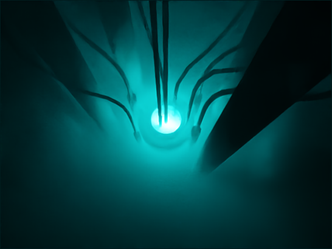

# CPSC 591 Cherenkov Radiation Ray Marching
    University of Calgary Winter 2020: Term Project
    Jackson Cougar Wiebe

<figure class="image">
  
  <figcaption>Example denoised render</figcaption>
</figure>

## Project Dependencies

- GLFW 3    - https://www.glfw.org/     *submodule*
- OpenglGL  - https://www.opengl.org/   *implicit*
- cxxopts   - https://github.com/jarro2783/cxxopts  *header*
- nanogui   - https://github.com/wjakob/nanogui *submodule*
- glad      - https://glad.dav1d.de/ *header*
- stb       - https://github.com/nothings/stb *header*
- assimp    - http://assimp.org/ *submodule*
- ioid      - https://openimagedenoise.github.io/ *offline*

## Build instructions (CMake)

<b>IMPORTANT:</b> Clone the project recursively; some dependancies are via git submodules.
   
    git clone https://github.com/jacksoncougar/wxRayTracer.git --recursive

Building from the command line:

    mkdir build
    cd build
    cmake ../
    cmake --build . --target tracer
    
## Synopsis 

      Tracer [EMISSIVE_MESH_FILENAME] [CHAMBER_MESH_FILENAME] [OPTION...]

          --batch                Closes the program when the render finishes
      -p, --camera-position arg  The position of the camera in the scene
                                 (default: 0.000000 0.000000 0.000000)
      -t, --target arg           The target to point the camera towards (default:
                                 0.000000 0.000000 0.000000)
      -c, --colour arg           The colour of the glow (default: 0.007843
                                 0.796078 0.835294)
          --gather-surface       Enables surface radiosity gathering (default: 1)
      -e, --extinction arg       The amount of light that is extinguished per
                                 unit of distance (default: 0.080000)
      -f, --falloff arg          Controls the distance at which light is emitted
                                 in the volume (default: 2.500000)
      -a, --absorption arg       The amount of light that is emitted per unit of
                                 distance (default: 0.200000)
      -s, --scattering arg       The amount of light that in-scatters per unit of
                                 distance (default: 0.100000)
      -i, --intensity arg        The brightness of the light that is emitted in
                                 the volume (default: 100.000000)
          --p0 arg               Depth 0 ray marching parameters (default: 1 1 8
                                 8 8)
          --p1 arg               Depth 1 ray marching parameters (default: 1 1 0
                                 2 0)
          --p2 arg               Depth 2 ray marching parameters (default: 1 1 0
                                 0 0)
      -h, --help                 Print usage

## Controls

<dt>ESC<dt> <dd>Hides the GUI elements </dd>

## Statement of code reuse

I am using:
- GLFW 3    - https://www.glfw.org/
- OpenglGL  - https://www.opengl.org/
- cxxopts   - https://github.com/jarro2783/cxxopts
- nanogui   - https://github.com/wjakob/nanogui
- glad      - https://glad.dav1d.de/
- stb       - https://github.com/nothings/stb 
- assimp    - http://assimp.org/

Where applicable I have tried to include in-code citations.