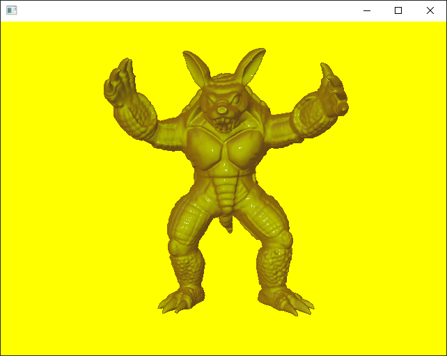

# CPSC 591 Ray Traced Lighting from Attribute Images
    University of Calgary Winter 2020: Assignment 2
    Jackson Cougar Wiebe

## Project Dependencies
- GLFW 3 
- OpenglGL

## Build instructions (CMake)

Building from the command line:

    cd wxRayTracer
    mkdir out
    cmake ../
    
## Synopsis 

Run the program with two arguments from the command line:

    tracer ATTRIBUTE_IMAGE_FILENAME PLY_MODEL_FILENAME
  
## Controls

    W       move camera upwards
    S       move camera downwards
    
    UP      scale subject up
    DOWN    scale subject down
    
    F1      load silhouette material
    F2      load highlighting material
    F3      load depth material
    
    -       decrement primary material parameter
    +       increment primary material parameter
    PgDn    decrement secondary material parameter (depth only)
    PgUp    increment secondary material parameter (depth only)
    
## Code reuse

I am using:
- GLAD (https://glad.dav1d.de/)
- stb (https://github.com/nothings/stb)
- tinyply (https://github.com/ddiakopoulos/tinyply)